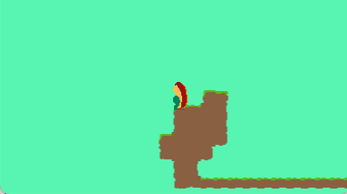
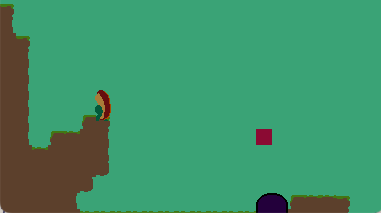
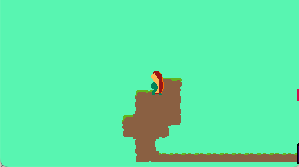

## The Basics

`Lua` is my weapon of choice for most game development which I end up pairing with [pico-8](https://lexaloffle.com) or [love-2d](https://love2d.org).
I love how fast and dirty I can be with `Lua`, but man does that sometimes the lack of type-safety bites me in the butt.
To remedy this, I try to set myself up for success by getting some me type-safety via [lua language server](https://luals.github.io/) and it's [annotations](https://luals.github.io/wiki/annotations/).

I'm still trying to figure out how I best like working with love-2d.
For a few of my projects I've used an [Entity Component System](https://en.wikipedia.org/wiki/Entity_component_system) approach via [tiny-ecs](https://github.com/bakpakin/tiny-ecs/tree/master).
That's what I'm using for **Sundog**.

This is what I've got so far: 


All keys on the right of the keyboard map to 'right' and all on the left map to 'left'.
Jumping works like in **Mooncat**, where if you're going right and then hit left you will jump.

It's still very janky but figured I'd post what I have here.

---

## Level Transitions 

I have the level transitions working now.

Here is what that looks like:


How this works is, in [LDtk](https://ldtk.io) I have `PLAYER_SPAWN` entities and `LEVEL_EXIT` entities.
`LEVEL_EXIT` entities are linked to `PLAYER_SPAWN` entities in other levels.

So, I have _Level_0_ setup below, which has a `PLAYER_SPAWN` entity and a `LEVEL_EXIT` entity.

### Spawning the player

When `PLAYER_SPAWN` entities are parsed from LDtk levels, they have a `player_spawn` component and a `position` component:
```lua
{ 
  player_spawn = true,
  position = vector(x, y),
}
```

There is then a `PlayerSpawningSystem` that processes all entities with `player_spawn` and `position` components.
When a player spawn is added to the system, it will:
* check if a player is already present
  * if not, make a player entity
* set the player entity `position` component to the player spawn `position`

```lua
---@param e PlayerSpawn | Position
function PlayerSpawningSystem:onAdd(e)
  if not self.player then
    self.player = self.entity_factory:build({
      id = 'PLAYER',
    })[1]
  end
  self.player.position = e.position:clone()
  self.world:addEntity(self.player)
end
```

### Level exit

When `LEVEL_EXIT` entities are parsed from LDtk, they look like this:

```lua
{
  is_level_exit = true,
  drawable = { sprite = love.graphics.newImage('assets/exit.png') },
  collidable = { radius = 16 },
  trigger = {},
  position = vector(x, y),
  linked_level_id = 'Level_1',
}
```

When a collision is processed between the player the following is added to the world:
```lua
{
  entity_transition_event = {
    transition_time = 1,
    fade_out = true,
    level_to_load = level_exit.linked_level_id,
  }
}
```

The `ScreenTransitionSystem` processes entities with the `entity_transition_event` component.

It will:
* draw a black rectangle on the screen with changing value for alpha
  * alpha value increases for `fade_out` events
  * alpha value decreases for `fade_in` events
* if `level_to_load` is present and `fade_out` event is done, it will:
  * clear all entities from the world
  * add a `load_tile_map` event for the `level_to_load`

`ScreenTransitionSystem` has a function that runs whenever an entity that it is processing is removed.
It uses this as a hook create the corresponding `fade_in` event for the `fade_out` event that was removed (when removing all entities)

There is a system that listens to `load_tile_map`, it loads and parses levels from LDtk.
All of the entities in the new level will be added to the system, including the `PLAYER_SPAWN` event.
The `PlayerSpawningSystem` I talked about before will move the player to position of the new player spawn event.

### Putting it all together

1. player collides with `is_level_exit`
2. a `fade_out` screen transition event is created, which contains the `level_to_load` from the level exit entity
3. the screen starts fading out to black
4. when the fade out is complete, all entities are removed the world
5. a `load_tile_map` event is created, pointing to `level_to_load`
6. player spawn is added
  a. the player that was removed in step 4 is added back into the world
  b. player position is updated to player spawn position
7. a `fade_in` screen transition event is created
8. screen starts fading in from black
9. when the fade in is complete, the `fade_in` even its removed.

---

Phew.
It seems like a lot going on in a few different places, and I guess it is.
It feels that way when typing it all out.
I think the benefit of ECS is that the code is simple to read since it's all in well defined systems.
I'm getting the sneaking suspicion though that this cost-savings will end up costing me in the future, as _remembering_ the system-to-system interaction is where the complexity really lives within ECS-backed games.

---

### Reuse

A nice thing here is to handle restarts if the player falls out of the level, we can reuse all of the above to get the player to respawn right where they were.

When levels are loaded from `LDtk`, the level's top-left coordinates, along with the level's bottom-right coordinates, are stored.
We check the players position against these boundaries, and if the player is out of bounds we trigger the same screen transition flow, only with the current level id.



source: https://github.com/michaeljosephpurdy/eggplant-jam-25
