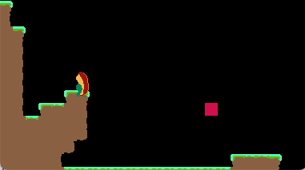

## Camera stuff

I hooked up the level boundaries to the camera system.
I've been using the same camera system for the past couple of years.
It works in a fairly straightforward way, and thankfully in pretty game-agnostic, so I'm able to lift it from game to game and it 'just works'.



This is the guts of it looks like this:
```lua
self.old_position = self.position:clone()
self.position = e.position + self.offset

if e.position.x >= self.level_info.bottom_right.x - GAME_WIDTH / 2 then
  self.position.x = self.level_info.bottom_right.x - GAME_WIDTH
elseif e.position.x <= self.level_info.top_left.x + GAME_WIDTH / 2 then
  self.position.x = self.level_info.top_left.x
end

if e.position.y >= self.level_info.bottom_right.y - GAME_HEIGHT / 2 then
  self.position.y = self.level_info.bottom_right.y - GAME_HEIGHT
elseif e.position.y <= self.level_info.top_left.y + GAME_HEIGHT / 2 then
  self.position.y = self.level_info.top_left.y
end

self.position.x = lerp(self.old_position.x, self.position.x, self.speed * dt)
self.position.y = lerp(self.old_position.y, self.position.y, self.speed * dt)

love.graphics.translate(-self.position.x, -self.position.y)
```

---

#### Breaking it down

First, we clone the position from last frame, since we'll use that to smoothly move to new position
```lua
self.old_position = self.position:clone()
```

`e` is the entity we are tracking.
We apply an offset to it's position, effectively moving it into the center of the screen.
```lua
self.position = e.position + self.offset
```

We then check the left and right side of the level, and clamp the camera's `x` position.
This is so the camera will not move utside of the level boundaries
```lua
if e.position.x >= self.level_info.bottom_right.x - GAME_WIDTH / 2 then
  self.position.x = self.level_info.bottom_right.x - GAME_WIDTH
elseif e.position.x <= self.level_info.top_left.x + GAME_WIDTH / 2 then
  self.position.x = self.level_info.top_left.x
end
```
We do the same thing for top and bottom of the level
```lua
if e.position.y >= self.level_info.bottom_right.y - GAME_HEIGHT / 2 then
  self.position.y = self.level_info.bottom_right.y - GAME_HEIGHT
elseif e.position.y <= self.level_info.top_left.y + GAME_HEIGHT / 2 then
  self.position.y = self.level_info.top_left.y
end
```
Now that we have our position calculated, we start moving to it, but we don't move directly to it, we use a linear interpolation to move the camera somewhat slowly.

```lua
self.position.x = lerp(self.old_position.x, self.position.x, self.speed * dt)
self.position.y = lerp(self.old_position.y, self.position.y, self.speed * dt)
```

Finally, we apply the camera by calling `love.graphics.translate`
```lua
love.graphics.translate(-self.position.x, -self.position.y)
```

