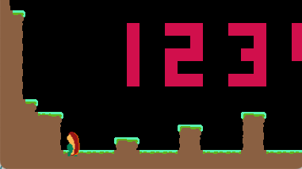
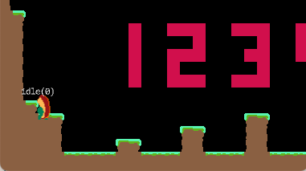
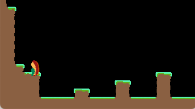
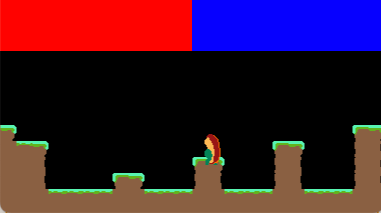
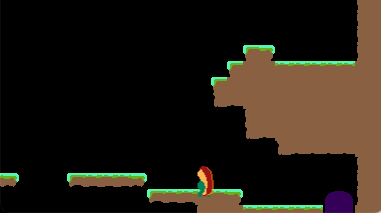
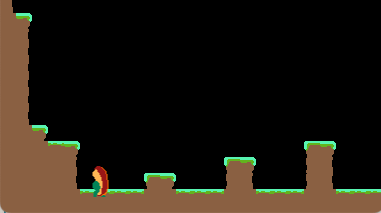

## Controls

**Mooncat**'s controls are a very important part of the game.
It's a two-button game, the right button moves the character right, the left button moves the character left.
These controls are mapped onto the actual controller in an interesting way, where the d-pad/directional input is 'move left', and the a/b buttons on the controller are 'move right'.

I'm on vacation, away from my desktop (writing this on my macbook), so I had to do some research to refresh my brain on the full extent of the controls.
I found [this post](https://steamcommunity.com/sharedfiles/filedetails/?id=3334076070) on Steam that describes the control scheme really well:

> Jump by moving in one direction and then pressing the other button. Hold for longer jump.
> 
> Slam after jumping by pressing the other button again, or pressing both buttons while you are falling. Holding a button (or not holding either) will determine the direction you are launched after a bounce.
> 
> Dash and Run by double tapping a button and hold to run.
> 
> Dash Jump is similar to dashing, but instead of pressing one button twice, you press and hold both buttons on the second tap. This jump works when you slide off platforms and makes it possible to do some extra long jumps.
> 
> Air Spin by double tapping a button in mid-air. If the button is for the direction you are moving in, you will gain a bit of forward momentum. If you hold the button you will run after landing. Using this with a dash jump makes it possible to do five tile long jumps with good timing. If the button is for the opposite direction you are moving in, you do a useless spin.

I'll be honest here: replicating its control scheme will result in the most indepth control scheme that I've ever built, and will likely take me out of my comfort zone a bit.

Nothing I can't handle.

However, I'm not really sure if I want to just replicate the existing control scheme.

## Current State

### Basic movement

Basic movement is already in place.

`F6, 6, Y, H, N` and anything to the right of them, are treated as _right_, and everything to the left is _left_.
`up, right` on the arrow keys is also _right_, and `down, left` are _left_.

This is checked in the 'easiest' way possible: **a very long if/else condition**.
It sounds silly but any editor with multi-line edit or macro support makes writing this trivial.

If the left or right side of the keyboard is pressed, its corresponding counter is incremented.
If that side is not pressed, then the counter is reset to 0.

### Jumping

The same left/right counters are checked to initiate a jump.

If both counters are not 0, use the one that is higher to determine which direction to jump in and jump if the player is on the ground.

Currently, this is a non-variable height jump.

The work is done by two systems, one that applies the velocity, and one that locks the players direction.
```lua
---@param e Jumpable | Velocity | Collidable
function JumpableToVelocitySystem:process(e, dt)
  if not e.jumpable.perform_single_jump then
    return
  end
  e.jumpable.perform_single_jump = false
  if e.collidable.on_ground then
    e.jumpable.did_single_jump = true
    e.velocity.y = -e.jumpable.jump_height
  end
end

---@param e Jumpable | DeltaPosition
function JumpableToDeltaPositionSystem:process(e, dt)
  if not e.jumpable.did_single_jump then
    return
  end
  if e.jumpable.move_forward then
    e.delta_position.x = 1
  elseif e.jumpable.move_backward then
    e.delta_position.x = -1
  end
end
```

## Improvements

### Variable height jumping

I think I can get away with using the same keyboard data to build out variable height.

I can modify `JumpableToVelocitySystem` to process a portion of the velocity each frame until it hits a certain threshold.

Currently the player can jump 4 tiles high.


A favorite game of mine is **Aban Hawins and the 1000 Spikes**, a XBox Live Arcade game from early 2010s, which was later released to more platforms under the name of [**Aban Hawkins and the 1001 Spikes**](https://en.wikipedia.org/wiki/1001_Spikes).
The game has two discrete jump heights, small and large.
There was a lot of _readability_ in the level design, so as a player you quickly learned when you needed to perform each of the jumps.
I always liked this, so I think I'll do the same thing here.

Small jump: 2 tile jump

Large jump: 4 tile jump

Aban Hawkins has two separate buttons for these jumps (or down + jump to trigger large jump).

I don't have the luxury of different buttons for different jumps, so I'm thinking...

You hold both buttons to charge for a jump.
We'll keep track of how long the player is charging their jump by adding `dt` to a variable each frame.
When the player releases the button pressed last, then the jump is executed.

If you hold for less than a certain threshold, you will execute a small jump.
If you hold for more than a certain threshold, you will execute a large jump.
Maybe if you hold it for longer than a threshold, the jump is cancelled.

---

Alright, so what's written above is in place now:



The player has a 2 tile jump and a 4 tile jump, and you hit those jumps depending on how long you hold down the button for.

I currently have it setup to where if you hold it for a full second the jump is then 'cancelled'.
I don't really know how I feel about this, and I think I may gut it.
The problem with it is that it penalizes players for prepping their jump ahead of time.

---

Okay, so, yeah, that cancel was a bad idea.
Really didn't feel good at all.
I removed that, and now I think it's setup the way it should be.

If you're holding down both buttons you will start charging a jump.
If the jump is charged below a certain threshold, you will perform a small jump, otherwise a large jump.



---

I figured a good way to show the player input is to draw it over the screen.
Blue overlay means right input, red overlay means left.



This helps explain a bug in place right now:

If you are running left and you push down on right, you begin charging a jump.
This is good, and expected.

And if you let go of right, you will trigger a jump.
Also good, and also expected.

But, what happens when you let go of left?



**You immediately jump to the right!**

That's not good.
What I think should happen here is that when you let go of the direction you're going in, you begin moving in the other direction.
If that happens, your jump charge should likely reset.

---

All fixed up.



The `Controller` determines if the current input is `right_dominant` or `left_dominant`, as well as what those values were in the previous frame.
`right_dominant` means both buttons are down, but the right one is down 'more', or for longer.
```lua
function ControllerState:is_right_dominant()
  return self.left > 0 and self.right > self.left
end
```

With this info, we can see if they flipped directions like this:
```lua
function ControllerState:flipped_directions()
  return (self.was_right_dominant and self.right == 0) or
         (self.was_left_dominant and self.left == 0)
end
```

We can inspect that in the jump system and reset the charge value accordingly
```lua
if e.jumpable.state == 'charging' and self.controller_state:flipped_directions() then
  e.jumpable.state = 'idle'
end
if e.jumpable.state == 'idle' then
  e.jumpable.charge = 0
end
```

## Overall code changes

When I started working on the jump mechanics today, I had some of this work being done by multiple systems.

It's always easier to break problems down into smaller pieces.
Sometimes it makes sense for those smaller pieces to live in different functions, or different files.

Previously, I had the jump-related code in a few systems.
It _sort of_ made sense to do that.
Code that relates to jumping and mutates `delta_position` should go in `JumpableToDeltaPositionSystem`.
Same with jumping code that mutates `velocity`, a perfect place for that would be the `JumpableToVelocitySystem`.
The problem is is when these systems end up 'prepping' fields for downstream systems.

`ControllableToMovableAndJumpableSystem` was handling controller inputs and mutating `movable` and `jumpable` components of entities.
But those downstream systems don't do anything unless that upstream system sets `Jumpable.state` to `charging` or `jump`.

`ControllableToMovableAndJumpableSystem` has now been split into `ControllableToMovableSystem` and `ControllableToJumpableSystem`, and the later now has all of the jump related code, so no more `JumpableToDeltaPositionSystem` or `JumpableToVelocitySystem`.

I _think_ that it's better off this way.
In the end, it's working the way I wanted it to, and making the game is what's important.

---

source: https://github.com/michaeljosephpurdy/eggplant-jam-25
