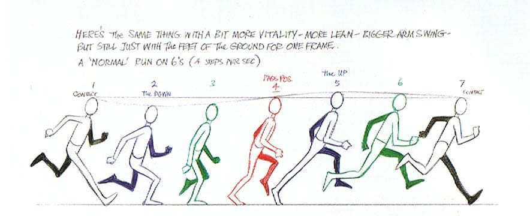
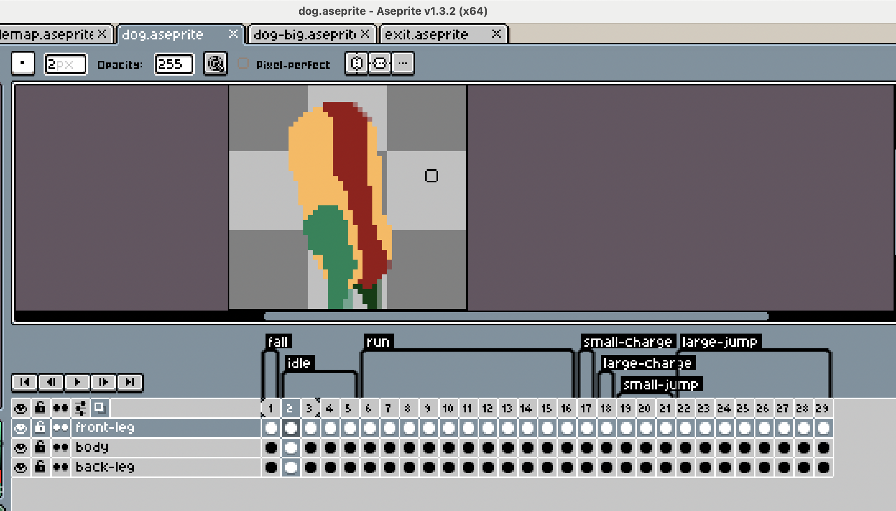
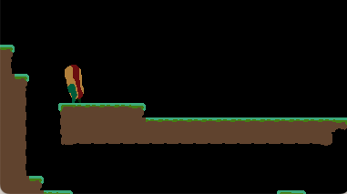

## Animating the Character

I know I shouldn't be focusing on the art so early in this project, but I:
* think it will help me feel good about the progress
* want to

I usually use [Aseprite](https://aseprite.org) or [Procreate](https://procreate.com) for art.
Not that I _really_ know what I'm doing.
I figured Aseprite would be the right tool for this job.

I searched 'run cycle' on DuckDuckGo and clicked the first non-YouTube link:
[The Key Poses of a Run Cycle](https://blog.animschool.edu/2024/04/10/the-key-poses-of-a-run-cycle/).
That article had a nice image that looked like a good thing to model this run cycle off of.




So, after a bit of work, I got this run cycle built.

I built the character with three layers, one for the back leg, one for the body, and one for the front leg.


Came away with this sick run cycle


It looks a bit rough, but I think it has some charm.

I went ahead and made some more for other player states



## Bringing the animations into the game

I decided to use [peachy](https://github.com/josh-perry/peachy) to take the exported spritesheets + `json` and animate them in the game.

This made implementing this stuff extremely straightforward.

### Drawing

All drawing in the game so far is done in `SpriteDrawingSystem`, which filters entities if they have `drawable` and `position` components, and draws them.
The entities are sorted by `z_index or 0`, and the `drawable.sprite` is drawn where their `position` is (after applying an offset if specified).

I modified that to also look for `drawable.animation`, and if that is present, to draw that instead of the `drawable.sprite`.

### Updating animation

`peachy` is pretty sweet, and I created a small system that filters for `drawable` and `animation` components, updates the current animation each frame, and updates the `drawable.animation` to whatever the `animation.animation` object is pointing to.

```lua
local SpriteAnimatingSystem = tiny.processingSystem()
SpriteAnimatingSystem.filter = tiny.requireAll('drawable', 'animation')

---@param e Animation | Drawable
function SpriteAnimatingSystem:onAdd(e)
  e.animation.animation = peachy.new(e.animation.data, e.animation.image)
  e.drawable.animation = e.animation.animation
end

---@param e Animation | Drawable
---@param dt number
function SpriteAnimatingSystem:process(e, dt)
  e.animation.animation:setTag(e.animation.current_tag)
  e.animation.animation:play()
  e.animation.animation:update(dt)
end

return SpriteAnimatingSystem
```

### Setting each animation

Animations, for the player at least, are determined in a new system called `PlayerAnimationSystem`.

All this does is set the `animation.current_tag` to whatever it should be for the given player state.

```lua
---@param e Animation | Movable | Jumpable | Drawable | Velocity
function PlayerAnimationSystem:process(e, dt)
  e.animation.current_tag = 'idle'
  if e.movable.is_moving then
    e.animation.current_tag = 'run'
  end
  if e.jumpable.state == 'charging' then
    if e.jumpable.charge_small_jump then
      e.animation.current_tag = 'small-charge'
    elseif e.jumpable.charge_large_jump then
      e.animation.current_tag = 'large-charge'
    end
  elseif e.jumpable.state == 'jumping' then
    if e.jumpable.did_small_jump then
      e.animation.current_tag = 'small-jump'
    elseif e.jumpable.did_large_jump then
      e.animation.current_tag = 'large-jump'
    end
    if e.velocity.y > 0 then
      -- TODO fall animation?
      e.animation.current_tag = 'run'
    end
  end
  if e.movable.last_direction == 'forward' then
    e.drawable.flip = false
  elseif e.movable.last_direction == 'backward' then
    e.drawable.flip = true
  end
end
```

## Result




I've still got some more stuff to do, the main things that come to mind are:
* better short jump animation
* implement a fall animation
* cleanup some of the sprite work

That being said, I'm really pleased with the result!
I'm glad I took a break from 'core mechanics' work and built this out and I think it is pretty fun and silly looking :)
