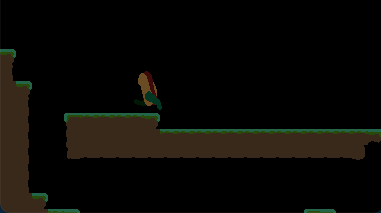
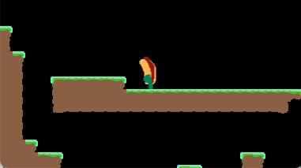

## Type-checking in Lua

I mentioned in [devlog - 02](../devlog-2) that I use annotations from [Lua Language Server](https://luals.github.io) to get some static type checking for my code.
Without it, I find myself spending way too much time tracking down silly issues.

Currently I have all of these types defined in `components.lua`.
It's just a large file that contains all of the definitions of the components that I'm creating within this project.

```lua
---@class Drawable
---@field drawable _Drawable
---@class _Drawable
---@field z_index? number
---@field sprite? love.Image
---@field animation? {}
---@field flip? boolean
---@field sprite_offset? Vector.lua
```

Systems then reference these types directly:
```lua
---@param e Animation | Movable | Jumpable | Drawable | Velocity
function PlayerAnimationSystem:process(e, dt)
```
What I like about this, is that I am declaring only the properties that I need to read or mutate in the function.
This helps me be well intentioned in my implementation.

The downside to this is that it can get a little out of hand during entity creation or referencing.
Currently, during entity creation, the player's table definition is appended with
```lua
--[[@as Gravity | FuturePosition | DeltaPosition | Velocity | Collidable | Jumpable | CameraActor | Controllable | Movable | Drawable | Player]]
```

This gets to be a bit of a pain, so I'm now also defining Entities as well.
```lua
---@alias Entity PlayerEntity | PlayerSpawnEntity | LevelExitEntity
---@alias PlayerSpawnEntity PlayerSpawn | Position
---@alias PlayerEntity
---| Player
---| Position
---| Drawable
```

That way the player table is just tagged with 
```lua
---@type PlayerEntity
```
and if a system is entity-specific, it can be tagged like this

```lua
---@param e PlayerEntity
function PlayerAnimationSystem:process(e, dt)
```

---

## Actual Progress

Sometimes it's easy to get sidetracked in game development.
It's easy to spend a lot of time just continuously refactoring or improving the code without actually building the game.
Decisions to remake the typing like above treads into that a bit, which I'm always concious of.

When I get to 'clever' I think back to Balatro's huge `if/elseif/else` conditional.
Sadly the Twitter/X post about this has been deleted, but here is a [r/gamedev post](https://www.reddit.com/r/gamedev/comments/1cbcmr0/how_is_it_possible_that_the_balatro_dev_did/) about it.
Big brained engineers may scoff at this, but players don't care of even know about it.
I also think back to the great [https://grugbrain.dev](https://grugbrain.dev) and the **Complexity Spirit Demon**.

It's easy to spend time getting clever with refactoring but really I need to make some progress on the real game.

### Slowing down the player while charging up

I think I want the player to slow down while charging.
Maybe when they hold it past a certain threshold they stop all together.

The main driver for this decision is the current animation, but I also think it would help avoid players just running with a fully charged up jump.
That's what I ended up always doing when playing Megaman as a kid, and it is sort of lame.



See?
It's weird that the player just slides.

I solve this by modifying the `delta_position` of the player when they are charging:
```lua
-- come to graceful stop while charging jumps
if charge_forward then
  e.delta_position.x = e.delta_position.x - e.jumpable.charge / 1
  if e.delta_position.x < 0 then
    e.delta_position.x = 0
    e.velocity.x = 0
  end
elseif charge_backward then
  e.delta_position.x = e.delta_position.x + e.jumpable.charge / 1
  if e.delta_position.x > 0 then
    e.delta_position.x = 0
    e.velocity.x = 0
  end
end
```

I actually need to mess with the velocity too since velocity is calculated earlier in another system.

The end result is pretty legit


