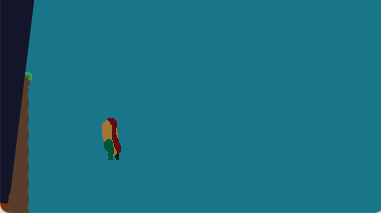
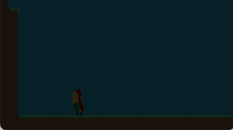
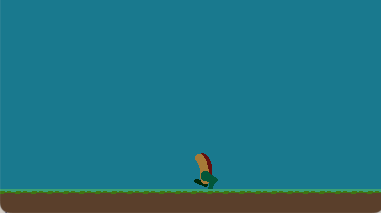
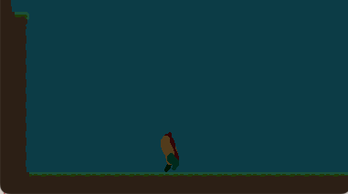
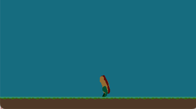

## Progressing Gameplay

As cool as it was animating the player (see [Devlog - 05](../devlog-5/)), we need to make this game an actual game.

I'm thinking a good first step will be incorporated our first enemy.

### The Cart

The main idea so far for the game is that you've escaped a hotdog cart, and are trying to get to the beach.
I'm thinking there will be a small amount of levels, the first is just outside of the hotdog cart in the city, and the last being the beach or the boardwalk.
Not sure about what lies in between.

[www.learnhotdogs.com](https://learnhotdogs.com) has a [whole section](https://learnhotdogs.com/what-size-hot-dogs/) on hotdog sizes, and I guess your standard at-home hotdog is `8:1`, meaning that there are 8 in a 1lb package.
Never thought of them being labeled like this in what I'd consider a _ratio format_.
www.learnhotdogs.com is apparently a site for folks interesting in starting hotdog carts, and from the looks of it, is a pretty good resource.

This might be helpful for thinking through other items that could appear on the cart, or we could even use [www.hotdogcartstore.com](https://hotdogcartstore.com) for help creating one.

## Walkers

When I think of the environment just outside of the hotdog cart, I picture people walking by.
Since we're a hotdog, I think the shoes/boots will be pretty large, but not too big.

So, maybe 'walkers' are moving across the map and you need to get out of the way of them.
I think this could work with a shadow growing on the floor with a foot coming down and meeting it.
The shadow would grow in size until the foot comes down and meets the ground.
Afterwards the foot moves up and the shadow grows smaller.
The shadow will be both _realistic_ and a mechanism to _telegraph_ the enemy, not that I'm worried too much about the realistic-ness in a game where a hotdog is trying to get to a beach...

To implement this, I'm thinking...

I tag _where in the level_ that feet can hit, then have the foot come down on that spot every _x seconds_.
Each time it comes down we could have a different shoe/boot combination (_scope creep alert_).

I started with the shadow


I then started working on the boot.

### Weird bug

Rotations always confuse me a bit, so I incremented the boot's rotation, which is radians, by delta time each frame.
The idea was that this would help me zero-in on the rotational offset.



Why the hell is the screen transition constantly kicking off?

I was pretty confused, but realized what was going on after some debugging.

Filter functions in [tiny-ecs](https://github.com/bakpakin/tiny-ecs) can be defined two different ways, either directly or via helper functions that tiny-ecs offers
```lua
---@param e Collidable | Position
function CollisionRegistrationSystem:filter(e)
  return e.position and e.collidable and (e.collidable.radius or e.collidable.is_tile or e.collidable.is_solid)
end

SpriteDrawingSystem.filter = tiny.requireAll('position', 'drawable')
```

This would behave the same as:
```lua
function SpriteDrawingSystem:filter(e)
  return e.position and e.drawable
end
```

You can read more about `tiny-ecs` filter functions [here](http://bakpakin.github.io/tiny-ecs/doc/index.html#Filter_functions).
I'm not entirely sure which I prefer yet; the helper functions are more concise, but are a step backwards in type-safety.

The `WalkerEntity`, like any other entity added to the world, will be added to any system that it passes the filter for.

That's how this bug ended up happening.

`PlayerLevelBoundarySystem` checks the player's position against the level boundaries and initiates a restart of the level if the player goes out of bounds.
Take a look at it's filter function:
```lua
PlayerLevelBoundarySystem.filter = tiny.requireAny('player', 'position')
```

See the problem?
`tiny.requireAny` ends up being something like `return e.player or e.position`.
So, our `WalkerEntity` was being added to the `PlayerLevelBoundarySystem`, and when rotating it it was ended up out of bounds, triggering a level restart.

The fix is simple (`tiny.requireAny -> tiny.requireAll`), but it does make me sit back and think:
> Would this have been a problem if I just coded the filter function myself?

I'd like to think not.
Regardless, self-inflicted bug resolved.

### Back to the Boot

Eh, so, this isn't really working the way I'd like.
Or rather, I'm not getting it working well as fast as I'd like.

My idea was:
* Have the shadow staying on the ground, slowly moving to the left.
* It's `alpha` channel of the _shadow sprite_ will oscillate from 0, to 1, back to 0, etc.
* The _boot sprite_ `offset` will also oscillate along with the _shadow sprite_ `alpha channel`
  * when `alpha` channel is `1`, the _boot sprite_ `offset` will be 0, resulting in _boot sprite_ being directly on top of _shadow sprite_
  * when `alpha` channel is `0`, the _boot sprite_ `offset` will be large, resulting in _boot sprite_ being up the screen
* _boot sprite_ `rotation` will also oscillate along with the _shadow sprite_ `alpha channel`

I _think_ if I can pull this off, it will result in a boot rotating and coming down, with the shadow getting darker the closer the boot is to the ground.
I can check collisions on the shadow when `alpha` is over a certain threshold, which would be an easy way to kill off the player.
The main driver with this idea was to be able to just keep a basic `AABB` bounding box collision check and not having to worry about irregular polygon based collision checks.
Though maybe that'd be easier...

This is what I've got so far:


It looks like it's _close_ to working.

Honestly?
The math sort of gets confusing, lol.
I've got offsets of offsets of positions with rotations!

I've got it working more or less without the rotation, which is good.
~Sometimes,~ Breaking down a problem like this to small pieces is the way to go.




---

Implementing rotation, has small moments where it looks 'correct', but not quite.



---



This is much, much better.

My areas of focus when I pick this back up:
* Increase walk speed
* Decrease range of movement up the screen
