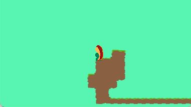

`Lua` is my weapon of choice for most game development which I end up pairing with [pico-8](https://lexaloffle.com) or [love-2d](https://love2d.org).
I love how fast and dirty I can be with `Lua`, but man does that sometimes the lack of type-safety bites me in the butt.
To remedy this, I try to set myself up for success by getting soe me type-safety via [lua language server](https://luals.github.io/) and it's [annotations](https://luals.github.io/wiki/annotations/).

I'm still trying to figure out how I best like working with love-2d.
For a few of my projects I've used an [Entity Component System](https://en.wikipedia.org/wiki/Entity_component_system) approach via [tiny-ecs](https://github.com/bakpakin/tiny-ecs/tree/master).
That's what I'm using for **Sundog**.

This is what I've got so far: 

All keys on the right of the keybaord map to 'right' and all on the left map to 'left'.
Jumping works like in **Mooncat**, where if you're going right and then hit left you will jump.

It's still very janky but figured I'd post what I have here.

---

Levels are built in [LDtk](https://ldtk.io).

source: https://github.com/michaeljosephpurdy/eggplant-jam-25
